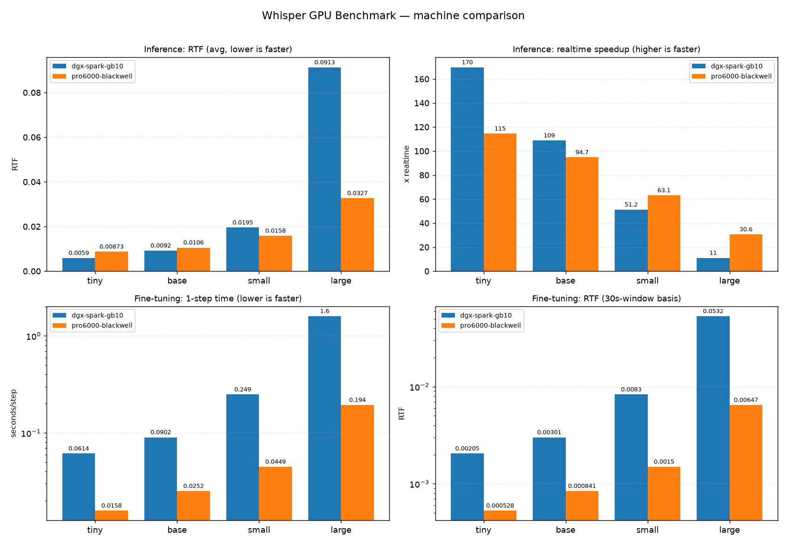

# Whisper GPU ベンチマーク (推論 / 軽量 fine-tuning)

RTF (Real-Time Factor = 処理時間 ÷ 音声長) を計測する。

## 環境
- GPU: NVIDIA RTX PRO 6000 Blackwell Max-Q Workstation Edition (sm_120, 約97GB VRAM)
- ドライバ CUDA: 13.0 / PyTorch ビルド: cu128
- torch: 2.11.0+cu128 (`torch.cuda.is_available() == True`)
- openai-whisper / soundfile / ffmpeg 6.1.1
- テスト音声: `jfk.wav` (16kHz mono, **11.000 秒**)

## 構築・実行
```bash
python3 -m venv venv && source venv/bin/activate
pip install --upgrade pip
pip install torch --index-url https://download.pytorch.org/whl/cu128   # Blackwell(sm_120)対応
pip install openai-whisper soundfile
ffmpeg -y -i jfk.flac -ar 16000 -ac 1 jfk.wav                          # テスト音声

python bench_infer.py    jfk.wav <tiny|base|small|large> 10 --machine pro6000-blackwell
python bench_finetune.py jfk.wav <tiny|base|small|large> 10 --machine pro6000-blackwell
```

## Gemma 推論ベンチ (テキスト生成 LLM)

Whisper とは別軸で、Gemma のテキスト生成スループットを計測する (`bench_gemma.py`)。
LLM は RTF ではなく以下の指標で測る:

- **TTFT** (Time To First Token): 最初の生成トークンまで = prefill レイテンシ
- **decode throughput**: 生成フェーズの tokens/sec
- **e2e throughput**: 全体の tokens/sec / **VRAM**: ピーク使用量

`--quant` で **fp16 / bf16 / int8 / int4** を切り替え、同じ条件軸でマシン横断比較できる
(int8/int4 は bitsandbytes)。Gemma は gated モデルなので HuggingFace のトークンと
ライセンス同意が必要。依存追加: `transformers accelerate bitsandbytes`。

```bash
pip install "transformers>=4.50" accelerate bitsandbytes
huggingface-cli login          # Gemma ライセンス同意済みアカウント

python bench_gemma.py google/gemma-3-4b-it  --quant fp16 --machine pro6000-blackwell
python bench_gemma.py google/gemma-3-27b-it --quant int4 --machine pro6000-blackwell
# 条件を変えて回すと results/gemma_<machine>_<model>_<quant>.json に蓄積される
```

## マシン横断での比較 (DGX Spark / RTX 5070 など)

各実行は環境メタデータ (GPU 名 / capability / arch / torch・CUDA バージョン / 音声長) 込みで
`results/<benchmark>_<machine>_<model>.json` に保存される。別マシンでも同じスクリプトを
`--machine <ラベル>` を変えて実行し、生成された JSON を同じ `results/` に集めるだけで比較できる。

- マシンラベル: `--machine` 引数、無ければ環境変数 `BENCH_MACHINE`、それも無ければ GPU 名から自動生成。
- 同一 (benchmark, machine, model) は最新結果で上書き (比較表が一意になる)。
- コード/パッケージの環境依存 (PyTorch の aarch64・CUDA ビルド等) は各環境ごとに別途整備する。
  JSON 基盤自体は追加依存なし (torch + 標準ライブラリのみ) で動く。

```bash
# 別マシン (例: DGX Spark) で実行
python bench_infer.py    jfk.wav large 10 --machine dgx-spark
python bench_finetune.py jfk.wav large 10 --machine dgx-spark

# results/ に集めた全 JSON からマシン横断の比較表を生成
python compare.py                 # 標準出力に表示
python compare.py --out COMPARISON.md

# 比較グラフ (PNG) を生成 (matplotlib 必要)
pip install matplotlib
python plot.py                    # charts/benchmark_comparison.png
```

最新の比較結果は [`COMPARISON.md`](COMPARISON.md) を参照。



## 結果 (音声長 11.000 秒, warmup 除外 / `torch.cuda.synchronize()` で同期)

### 推論 (fp16)
| model | avg 時間 | RTF(avg) | 実時間比 | best RTF |
|-------|---------|----------|---------|----------|
| tiny  | 0.097 s | 0.0088   | 113.8x  | 0.0083   |
| base  | 0.117 s | 0.0107   |  93.8x  | 0.0104   |
| small | 0.172 s | 0.0156   |  64.0x  | 0.0153   |
| large | 0.360 s | 0.0327   |  30.6x  | 0.0321   |

### fine-tuning (AMP fp16, AdamW lr=1e-5, 1 sample 過学習)
| model | 1step avg | RTF(音声11s基準) | RTF(30秒窓基準) | warmup_loss → final_loss |
|-------|-----------|------------------|-----------------|--------------------------|
| tiny  | 0.0193 s  | 0.0018 | 0.0006 | 0.5288 → 0.0725 |
| base  | 0.0253 s  | 0.0023 | 0.0008 | 0.4697 → 0.0231 |
| small | 0.0469 s  | 0.0043 | 0.0016 | 0.4619 → 0.0053 |
| large | 0.1945 s  | 0.0177 | 0.0065 | 0.4530 → 0.0002 |

VRAM が潤沢 (97GB) なためスキップしたモデルは無し。全モデルで loss が単調に低下しており、重みが実際に更新されている。
